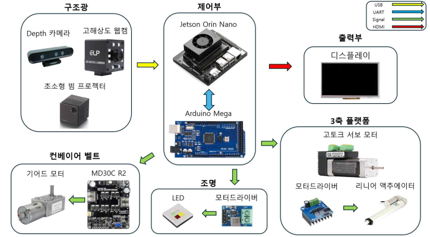

# 26_HC073

## Active Vision 및 구조광 기반 비정형 부품 정밀 검사 자동화 시스템

> 구조광 기반 3D 형상 분석과 Active Vision 기반 3축 자세 제어, 정상 데이터 기반 Anomaly Detection을 결합한 비정형 부품 자동 검사 시스템

---

## 1. 프로젝트 개요

### 1-1. 프로젝트 소개

본 프로젝트는 구조광 기반 3D 형상 분석과 Active Vision 기술을 이용하여 비정형 부품의 검사 사각지대를 줄이고, 정상 데이터 기반 Anomaly Detection을 통해 표면 결함을 자동으로 검출하는 지능형 품질 검사 시스템입니다.

검사체는 컨베이어를 통해 차광 검사 영역으로 이송됩니다. 구조광 패턴을 이용해 객체의 3D 형상을 복원하고, 표면 법선 정보를 기반으로 검사 가능한 면과 검사 자세를 생성합니다.

이후 Roll / Pitch / Z 3축 플랫폼을 이용하여 검사체의 자세와 카메라 거리를 능동적으로 조정하고, RGB 및 Depth 데이터를 이용해 검사 대상 ROI를 추출합니다.

추출된 정상 표면 영역은 64×64 Patch로 분할되며, 정상 데이터만 학습한 Autoencoder의 재구성 오차를 이용하여 이상 영역을 검출하고 최종 검사 결과를 Dashboard에 시각화합니다.

### 1-2. 개발 배경 및 필요성

다품종 소량 생산 환경이 확대되면서 제품 형상 변화에 유연하게 대응할 수 있는 검사 시스템의 필요성이 증가하고 있습니다.

기존 고정형 비전 검사는 일정한 카메라 위치와 조명 조건을 기반으로 하기 때문에 곡률이 크거나 반사가 강한 비정형 부품에서는 미세 스크래치, 찍힘, 단차 등이 가려질 수 있습니다.

특히 고광택 금속, 플라스틱 및 도장면은 표면 방향에 따라 반사와 음영이 크게 달라져 고정된 촬영 위치만으로 안정적인 검사가 어렵습니다.

본 프로젝트에서는 이를 해결하기 위해 다음 과정을 하나의 자동 검사 공정으로 통합했습니다.

**3D 형상 분석 → 검사면 탐색 → Active Vision → 표면 ROI 추출 → AI 이상탐지**

### 1-3. 프로젝트 특장점

- **구조광 기반 3D 형상 복원**
  - 사인파 구조광 패턴을 이용한 비정형 객체 3D Point Cloud 생성
  - 표면의 기울기 및 법선 정보 계산

- **Active Vision 기반 다각도 검사**
  - 구조광 결과를 기반으로 검사 가능한 면 자동 탐색
  - Roll / Pitch 자세를 조절하여 검사면을 카메라 방향으로 재배치

- **Automatic-Z**
  - Depth 품질과 검사 가능 영역을 기반으로 적절한 카메라-검사체 거리 자동 탐색

- **Depth 기반 Inspection ROI**
  - 배경과 검사체 경계를 제외하고 실제 검사 대상 표면만 추출

- **정상 데이터 기반 Anomaly Detection**
  - 정상 표면 데이터만 학습한 Autoencoder 사용
  - 별도의 결함 종류별 대규모 라벨링 없이 이상 후보 검출

- **통합 Inspection Dashboard**
  - Live RGB
  - 3D Point Cloud
  - Inspection ROI
  - Anomaly Heatmap
  - Roll / Pitch / Z
  - NORMAL / DEFECT 결과 시각화

### 1-4. 주요 기능

```text
검사체 투입
   ↓
컨베이어 이송
   ↓
구조광 촬영
   ↓
3D Point Cloud 생성
   ↓
검사면 / 표면 법선 분석
   ↓
Inspection Pose 생성
   ↓
Roll / Pitch 제어
   ↓
Automatic-Z
   ↓
RGB + Depth 획득
   ↓
Inspection ROI 생성
   ↓
64×64 Patch 추출
   ↓
Autoencoder Anomaly Detection
   ↓
NORMAL / DEFECT 판정
   ↓
Dashboard 시각화
   ↓
컨베이어 배출
```

### 1-5. 기대 효과 및 활용 분야

#### 기대 효과

- 비정형 부품의 광학적 검사 사각지대 감소
- 작업자 육안검사 의존도 감소
- 검사 결과의 정량화 및 일관성 향상
- 다품종 소량 생산 환경에 대응 가능한 검사 자동화
- 구조광·제어·AI를 통합한 스마트 제조 검사 워크셀 구현

#### 활용 분야

- 자동차 외장 및 가공 부품
- 플라스틱 사출품
- 알루미늄 및 금속 가공 부품
- 도장 및 고광택 외장 부품
- 가전제품 외장재
- 다품종 소량 생산 스마트팩토리 검사 공정

### 1-6. 기술 스택

| 구분 | 사용 기술 |
|---|---|
| OS | Ubuntu 22.04 |
| Language | Python, C/C++ |
| AI | PyTorch, Autoencoder |
| Computer Vision | OpenCV |
| RGB-D Camera | Orbbec Gemini 336L |
| 3D Vision | Structured Light, Depth, Point Cloud |
| GUI | PySide6 |
| 3D Visualization | PyVista, VTK |
| MCU | STM32 Nucleo-F302R8 |
| Communication | Serial |
| Version Control | Git, GitHub |

---

## 2. 팀원 소개

> 한이음 제출 지침에 따라 이름은 기재하지 않고 담당 역할 중심으로 표시합니다.

| 구분 | 담당 역할 |
|---|---|
| 멘티 | 구조광 기반 3D 형상 분석 및 Point Cloud |
| 멘티 | 3축 플랫폼 및 Active Vision 제어 |
| 멘티 | Anomaly Detection, ROI/Patch, 검사 Dashboard |
| 멘티 | 컨베이어·조명·시스템 통합 |
| 멘토 | 프로젝트 멘토링 및 기술 자문 |

---

## 3. 시스템 구성도

<p align="center">
  
</p>

---

## 4. 작품 소개영상

[](https://youtu.be/_txoyyJrdkA)

**Active Vision 및 구조광 기반 비정형 부품 정밀 검사 자동화 시스템**

구조광 기반 3D 형상 분석부터 Active Vision 기반 다각도 검사, AI 이상탐지 및 검사 결과 시각화까지의 전체 공정을 확인할 수 있습니다.

---

## 5. 핵심 소스코드

| 파일 | 역할 |
|---|---|
| [`run_inspection_with_ui.py`](src/tools/run_inspection_with_ui.py) | Production 검사와 UI 프로세스를 시작하는 대표 실행 Launcher |
| [`integrated_inspection_cycle.py`](src/integration/integrated_inspection_cycle.py) | 컨베이어 반입부터 구조광, 자세 제어, ROI, 이상탐지, 배출까지 전체 검사 Cycle 관리 |
| [`structured_light_runner.py`](src/integration/structured_light_runner.py) | 구조광 Pipeline 실행 및 Point Cloud / Pose 산출물 관리 |
| [`orbbec_controller.py`](src/camera/orbbec_controller.py) | Orbbec Gemini 336L RGB/Depth 획득 및 카메라 제어 |
| [`detector.py`](src/anomaly/detector.py) | Autoencoder 기반 Patch 이상탐지 및 Threshold 판정 |
| [`industrial_dashboard.py`](src/ui/industrial_dashboard.py) | RGB, PLY, ROI, Heatmap 및 검사 결과를 표시하는 PySide6 Dashboard |

### Anomaly Detection

```text
Inspection ROI
       ↓
64×64 Patch
Stride 32
Coverage 1.0
       ↓
Autoencoder
       ↓
Reconstruction
       ↓
MSE Reconstruction Error
       ↓
Anomaly Score
       ↓
NORMAL / DEFECT
```

---

## 6. Repository Layout

```text
26_HC073/
├── src/                  # 검사 및 제어 Production 코드
├── tests/                # 자동 테스트
├── config/               # 운영 설정
├── docs/                 # 시스템/통합 문서
├── assets/               # UI 및 참고 Asset
├── models/               # 운영 Autoencoder 모델
├── data/
│   ├── manifests/
│   └── production_validation/
├── calibration/          # Calibration 데이터
├── firmware/             # MCU/Firmware
└── archive/              # Legacy / 비운영 자료
```

촬영 원본, 일반 실행 결과, 로그 및 학습 중간 가중치는 Git에서 제외합니다.

Production에 필요한 모델과 Validation 입력은 저장소에 포함됩니다.

### Production Models

| Profile | Model | Validation Manifest |
|---|---|---|
| gray | `models/gray_v2/best_autoencoder.pth` | `data/manifests/gray_v2/val.csv` |
| blue | `models/blue_v1/best_autoencoder.pth` | `data/manifests/blue_v1_rot180/val.csv` |

Validation RGB 및 Mask는 다음 위치에 포함되어 있습니다.

```text
data/production_validation/
├── gray_v2/
│   ├── pose_08/
│   └── pose_09/
└── blue_v1_rot180/
    ├── pose_08/
    └── pose_09/
```

---

## 7. Setup

Python 3.10 기준입니다.

```bash
git clone https://github.com/ehdwls-lab/26_HC073.git
cd 26_HC073

python3.10 -m venv .venv
source .venv/bin/activate

python -m pip install --upgrade pip
python -m pip install -r requirements.txt
```

Hardware 환경:

```bash
python -m pip install -r requirements-hardware.txt
```

UI 환경:

```bash
python -m pip install -r requirements-ui.txt
```

---

## 8. Production 실행

### GRAY

```bash
python -m src.tools.run_inspection_with_ui \
  --profile gray \
  --ui-3d-mode ply \
  --execute
```

### BLUE

```bash
python -m src.tools.run_inspection_with_ui \
  --profile blue \
  --ui-3d-mode ply \
  --execute
```

`--execute` 사용 시 실제 컨베이어, 3축 플랫폼, 카메라 및 조명 장비가 동작합니다.

실행 전 반드시 다음을 확인해야 합니다.

- 시리얼 포트
- Orbbec SDK
- 프로젝터 모니터 배치
- 현재 Calibration
- 플랫폼 가동 범위
- Emergency Stop

---

## 9. Verification

다음 검증은 실제 하드웨어를 구동하지 않습니다.

```bash
python -m compileall -q src tests
python -m unittest discover -s tests -p 'test*.py'
```

현재 최종 검증 결과:

```text
Ran 368 tests
OK
```

Dry-run:

```bash
python -m src.tools.run_inspection_with_ui \
  --profile gray \
  --ui-3d-mode ply
```

```bash
python -m src.tools.run_inspection_with_ui \
  --profile blue \
  --ui-3d-mode ply
```

---

## 10. 운영 문서

- [카메라 소유권과 FramePump](docs/camera_ownership_preview.md)
- [현재 검사 물체 PLY](docs/current_object_ply.md)
- [최종 ROI 표시](docs/final_roi_visualization.md)
- [Live Preview 및 Launcher](docs/live_inspection_preview.md)
- [구조광 통합 및 Calibration](docs/structured_light_integration.md)
- [시스템 통합 규약](docs/system_integration_contract.md)
