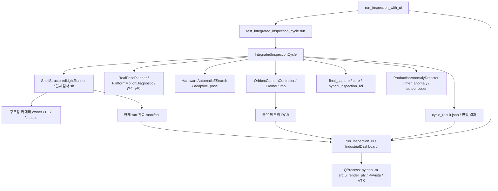

# GitHub 제출 / 전시 전 repository audit

기준: 2026-10-06 작업 트리. 기존 미커밋 Production/UI 변경을 보존했으며 이번 정리는
알고리즘·장비 설정·Python 소스 동작을 변경하지 않는다. 하드웨어 실행, commit, push는 하지 않는다.

## 운영 경로

`test_integrated_inspection_cycle.py`는 운영 dependency다. 테스트 이름이라는 이유로 이동하지 않는다.
`test_surface_only_pose_inspection.py`도 카메라 설정/정렬 프레임 helper의 lazy import 대상이다.
`src/integration/__init__.py` 등의 package re-export도 조사했다.

[production_dependency_graph.json](production_dependency_graph.json)은 런처에서 시작한 AST import
도달 경로와 package 초기화, UI renderer의 `-m` 실행을 포함한다. 조건부/TYPE_CHECKING/lazy import까지
보수적으로 포함하며 실제 매 실행에서 모든 모듈을 로드한다는 뜻은 아니다.
동적 구조광 경로는 별도로 shell, subprocess, `runpy.run_path`를 확인했다.

구조광 실행: `물체검사.sh` → 정식 Python wrapper → 보존된 `(1).py` 구현 →
`make_dc_grabcut_object_mask_latest.py`, `make_phase_relative_reunwrap_holefilled_0822.py`,
`add_platform_floor_latest.py`, `0823_test.py`. `초기세팅.sh`와 보정 스크립트도 preflight 필수 source다.
한글 이름과 `(1).py`를 유지한다.

## KEEP

| 경로 | 유지 이유 |
| --- | --- |
| `src/integration/`, `src/inspection/`, `src/core/` | 구조광 통합, metric/plane/pose, Auto-Z, 안전 전이, 최종 Geometry/ROI |
| `src/camera/`, `src/platform/`, `src/conveyor/`, `src/lighting/` | 카메라/플랫폼/반송/조명 owner와 protocol. `hardware/`로 통합 rename하지 않는다. |
| `src/anomaly/`, `src/autoencoder.py`, `src/infer_anomaly.py`, `src/preprocessing.py`, `src/patch_dataset.py` | 운영 AE와 정상 검증 입력 처리. 전처리/architecture/threshold 그대로 유지 |
| `src/ui/`, `src/tools/run_inspection*.py`, `src/tools/test_integrated_inspection_cycle.py` | observer UI, 현재 run PLY, IPC, 대표/하위 실행 경로 |
| `src/train.py`, dataset/manifest 도구, `src/tools/`의 계측·진단 도구 | 운영과 별도로 필요한 데이터 준비/학습/보정/장비 진단 CLI |
| `src/system/`, mock controller/planner/sampler, `src/run_system.py` | 회귀 테스트와 mock 통합 경로. 대표 런처 미도달만으로 dead로 보지 않는다. |
| `tests/`, `config/automatic_z_quality.json` | 하드웨어 없는 회귀 검증과 운영 quality 설정 |
| `3dof_PID_Select/`, `nema34test/`, `sketch_aug20a/` | STM32/컨베이어/조명·커버 펌웨어 및 프로젝트 설정 |
| `서영 파트 파일/`의 소스, projector 범위 JSON, `현재배치_기준데이터/active/` | 운영 구조광 source와 현재 장비 보정. NPY를 일괄 제외하지 않는다. |
| `models/gray_v2/best_autoencoder.pth`, `models/blue_v1/best_autoencoder.pth` | 작은 운영 가중치, 각각 1,630,201 bytes |
| 두 운영 `data/manifests/.../val.csv` | threshold 재현 입력 목록. 원본 RGB/마스크는 별도 배치 |
| `assets/ui/gray_object_01.ply`, `gray_object_02.ply` | 여러 테스트가 직접 읽는 참고 PLY. 자동 Production 물체 선택에는 사용하지 않는다. |
| `docs/`, `README.md`, `AGENTS.md`, requirements | 운영 문서/제출 설명/작업 규약/환경 설치 |

## ARCHIVE / DELETE 후보 (이번 작업에서 이동·삭제하지 않음)

| 후보 | 확인 근거 / 보류 이유 |
| --- | --- |
| `archive/src_old/` | 이미 격리된 과거 ROI/GUI/데이터 실험. 수동 실행/연구 증거 수요는 팀 확인 필요 |
| `src/stm32_controller_gui.py` | 별도 tkinter 시리얼 GUI, 대표 런처/UI와 독립. archive 동명 파일도 있으나 동일 구현으로 단정하지 않음 |
| `src/rgb_object_roi_test.py`, `src/ply_to_object_roi.py` | 독립 CLI/ROI 실험, 운영 graph와 외부 import 참조 없음. 수동 실행 수요 확인 후 archive 가능 |
| `src/test_aruco_rgb_depth_fused_roi.py`, `src/test_board_detection.py`, `src/test_depth_exposure_gain_sweep.py` | 카메라 직접 open 실험 CLI. 계측/연구 가치가 있어 보존, 운영 중 동시 실행 금지 |
| `assets/ui/inspection_plane_01.ply`, `inspection_plane_02.ply` | 각 `gray_object_01/02.ply`와 SHA256 일치, source/test/docs/shell에 이름 참조 없음. CLI 외부 override 수요는 확인 필요 |
| `src/ui/plane_assets.py:OBJECT_PLY_BY_PROFILE` | 코드 참조 없는 상수지만 ownership 문서가 설명하는 호환/의도 표식. 자동 plane mapping으로 쓰이지 않음 |
| `archive/pending_cleanup/root_artifacts/1280x720`, `848x480` | 기존 격리된 0-byte 파일. 운영 참조 없음, 제출 전 삭제 후보 |
| 비운영 `models/gray_v1/`, `models/archive/`, 모든 `last_autoencoder.pth` | 로컬 연구/학습 산출물로 보존, Git 추적만 해제 |

`capture_dataset.py`, `run_surface_inspection.py`, 학습/선택 도구는 독립 CLI가 있으므로
import되지 않는다는 이유로 삭제하지 않는다. 공유 이름 helper의 문자열 검색만으로 dead 판정하지 않았다.
`src/core/preprocessing.py`와 `src/preprocessing.py`처럼 서로 다른 입력/config 계약의 구현도
운영 도달/테스트 경로가 있어 병합하지 않는다. prototype의 plane/ROI helper와 기존 카메라 helper 역시 유지한다.

## legacy 경로 검토

- UI는 `current_object_ply()`로 현재 cycle의 완료 manifest만 읽는다. pose별 static PLY mapping이나
  과거 run의 segmented/latest PLY 검색은 observer 경로에 없다.
- `ShellStructuredLightRunner._latest()`와 segmented artifact 수집은 producer의 현재 결과 경로 처리다.
  UI의 과거 검색 잔재로 오인해 삭제하지 않는다.
- `--legacy-inspection-roi`는 실제 parse/실행 분기가 있는 수동 진단 옵션이다. 대표 런처에서는 전달하지 않는다.
- `--ui-object-ply`는 명시적 참고 모델 override이며 테스트가 검증한다. deprecated로 제거하지 않는다.
- UI와 PLY renderer는 카메라/장비 serial을 열지 않는다. renderer의 `plotter.camera`는 VTK 시점이다.
  구조광 자식 종료 후 Production이 Orbbec owner이고, preview 활성 시 FramePump 한 개가 획득한다.

## GENERATED / IGNORE와 실제 변경

- `data/`는 두 운영 val CSV만 허용하고 raw/학습/debug 이미지는 제외한다.
- `results/`, `Log/`, `.venv/`, `__pycache__/`, 로그, `core`, `core.*`, STM32 `Debug/`는 제외한다.
- `models/`의 재귀 `.pth/.pt` 제외에 운영 best 두 개만 예외를 둔다.
- 과거 구조광 샘플 233개와 비운영 가중치 5개는 `git rm --cached`로 추적만 해제했다.
  로컬 실험 결과/모델은 전부 남아 있다. 이 삭제는 Git index에 staged 상태다.
- 구조광 새 촬영은 기존 `촬영_*/` 규칙으로 제외한다. Qt/PyVista 렌더 PNG는 시스템 임시 디렉터리에
  생성한다. 수동 screenshot은 `results/screenshots/`에 저장하면 제외되며 docs 이미지/예제 PLY는 유지 가능하다.
- 소스 이동·rename·helper 제거·큰 파일 분할은 없다. 기존 src 역할 분할을 유지한다.
- 두 val CSV의 PC 절대경로만 상대경로로 변환했다. 8개 참조가 같은 파일로 resolve됨을 확인했다.
- UI requirements에 현재 환경의 PyVista 0.48.4 / VTK 9.6.2를 추가했다. common/hardware split은 유지한다.
  기존 scipy/torchvision 등은 import 흔적만으로 불필요하다고 단정해 제거하지 않았다.

과거 결과의 Git 추적 해제는 이전 commit의 blob을 지우지 않는다. 기존 이력을 purge/rewrite하지 않았다.
정리 전 현재 추적 파일의 합계는 169.34 MiB이며 대부분은 archive 촬영 데이터였다.

## 절대경로 / secret 검사

현재 tracked 파일과 새 source/test/docs/config에 대해 Python AST, shell/CLI/reference,
문자열 credential 패턴을 검사했다. API key/token/private key/password 패턴 일치는 없었다.
binary 모델/이미지 내부 및 전체 Git 이력에 대한 secret 검사를 뜻하지 않는다.

실행 source/config에는 특정 사용자 PC 경로가 발견되지 않았다. 두 운영 manifest의 PC 경로는 정리했다.
문서의 canonical root 예시도 `<repository-root>`로 바꿨다. 보정 정보 TXT의 과거 촬영 경로는
측정 기록으로 보존한다. STM32 `Debug.launch`의 개인 디렉터리는 IDE 선택 이력이며 Python 운영 입력이
아니다. 다른 PC에서 IDE 실행 시 workspace 설정을 다시 선택할 필요가 있다.
생성 샘플에 남은 개인 경로 로그는 Git 추적 해제 범위에 포함된다.
실제 `/dev/serial/by-id/...` 세 장비 경로는 유지한다.

## 문서 / 사람 확인 항목

README의 6개 핵심 파일 설명, 실행 명령, 운영 문서 링크를 보완했다.
`camera_ownership_preview`, `current_object_ply`, `final_roi_visualization`, `live_inspection_preview`,
`structured_light_integration`, `system_integration_contract`를 운영 링크로 추천한다.
`system_integration.md`는 mock/controller 초기 통합 배경으로 유지한다. 과거 설계 설명 전체를
현재 대표 런처로 해석하지 않는다. 중복/해결된 임시 debug 문서라고 확정할 근거 없이 이동하지 않았다.

제출자는 새 런처/카메라/UI/테스트/예제 assets/manifest/docs가 아직 미커밋임을 확인하고 함께 검토해야 한다.
검증 입력 8개의 배포 위치/접근 권한은 팀에서 정해야 하며 다운로드 링크는 미정이다.
기존 UI/FramePump 변경을 포함한 실장비 시연 검증은 별도 요청이 필요하다.
software dry-run 통과는 장비 GO 판정이나 모델/threshold 로딩 검증을 대신하지 않는다.

## 이번 작업 검증 결과

프로젝트 `.venv/bin/python`으로 실행했다. 물리 카메라/모터/시리얼은 실행하지 않았다.

- `python -m compileall -q src`: 통과
- UI/preview/current-object/frame-pump/final-ROI 집중 unittest: **56 passed**
- `python -m unittest discover -s tests -p 'test*.py'`: **368 passed** (skip 없음)
- 런처 `--help`, GRAY/BLUE `--ui-3d-mode ply` dry-run: 모두 종료 코드 0
- 두 운영 모델 `prepare()`: GRAY **169**, BLUE **239** validation patches 로딩 성공
- manifest 8개 입력의 경로 resolve 및 SHA256: 원본과 일치
- source/test/config/firmware/보정 파일 SHA256: cleanup 전후 동일
- 생성/비운영 파일 238개의 로컬 존재 및 ignore 처리, 운영 best/val/예제/docs 예외: 확인
- README 링크/의존성 graph 파일 경로 및 staged/unstaged `git diff --check`: 통과

현재 index에 남은 추적 파일은 **293개 / 18.87 MiB**다 (새 미추적 파일 제외).
작업 트리 전체 `git diff --stat`은 기존 사용자 변경을 포함해 **15 files, +502/-71**이고,
추적 해제 **238개**는 별도로 staged 상태다. 새 공개 대상 파일은 기존 작업을 포함해 26개이며,
`data/`에서 공개 대상으로 풀린 파일은 두 운영 val CSV뿐이다.
Git 이력의 기존 객체는 그대로 남는다. 이 숫자는 새 clean clone의 이력 포함 다운로드 크기가 아니다.

README READY: **YES**. 실제 하드웨어 시연 GO 판정은 별도 실장비 검증 후에 한다.
